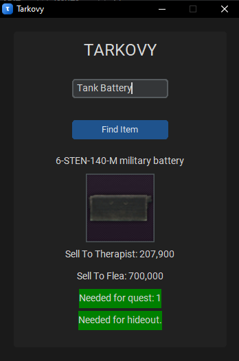
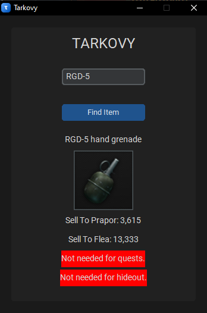

# Tarkovy
A helper software for Escape From Tarkov. And it's totally community based, everyone can use it without restrictions.
## Features
- Shows the best price for selling to traders.
- Shows the flea market price.
- Shows if the item is needed for quests.(FoundInRaid)
- Shows if the item is needed for hideout.

